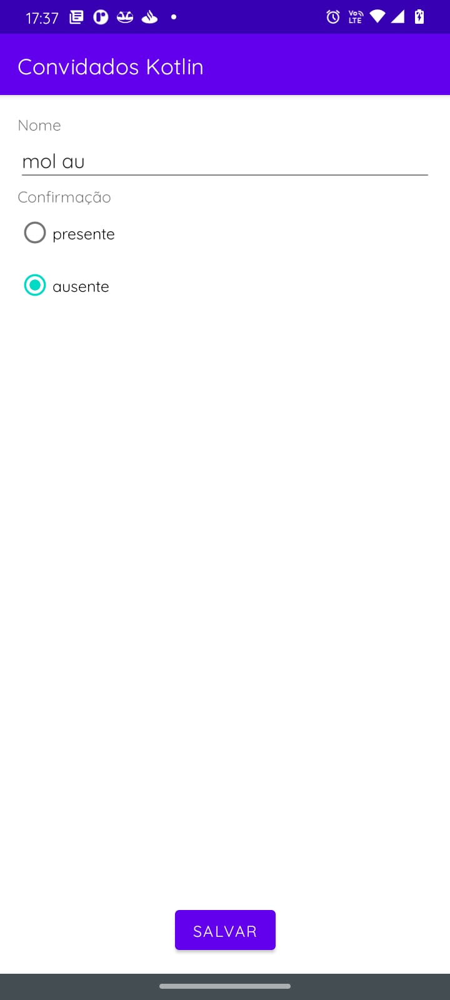
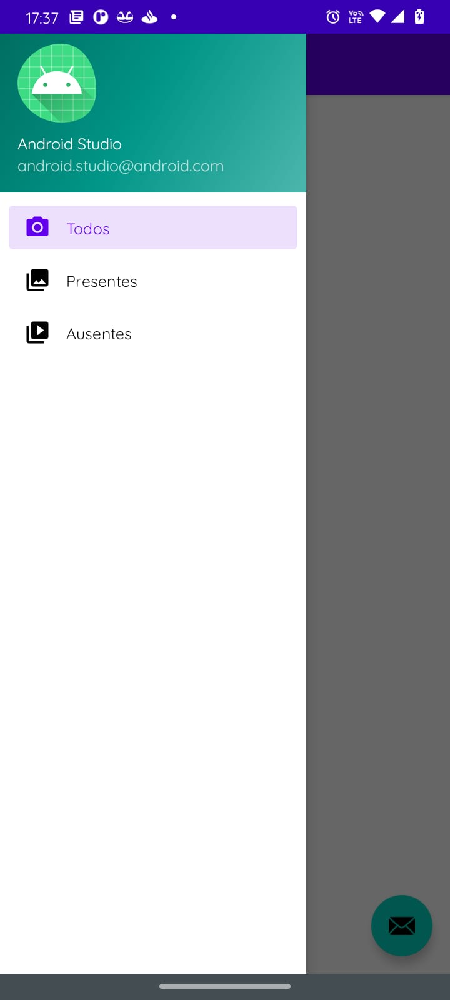
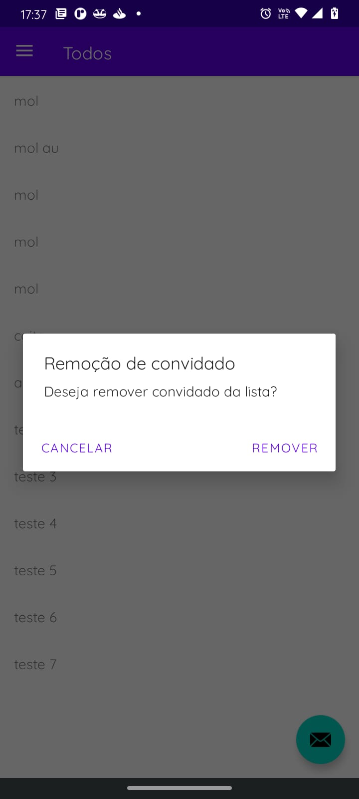

<h1>
    
    
    
    
</h1>

 

## 🧪 Tecnologias

Esse projeto foi desenvolvido com as seguintes tecnologias:

- [Android](https://reactjs.org)
- [Kotlin](https://reactjs.org)

## 💻 Projeto

Objetivo de exibir informações relacionadas a lista de convidados presentes ou ausentes.

